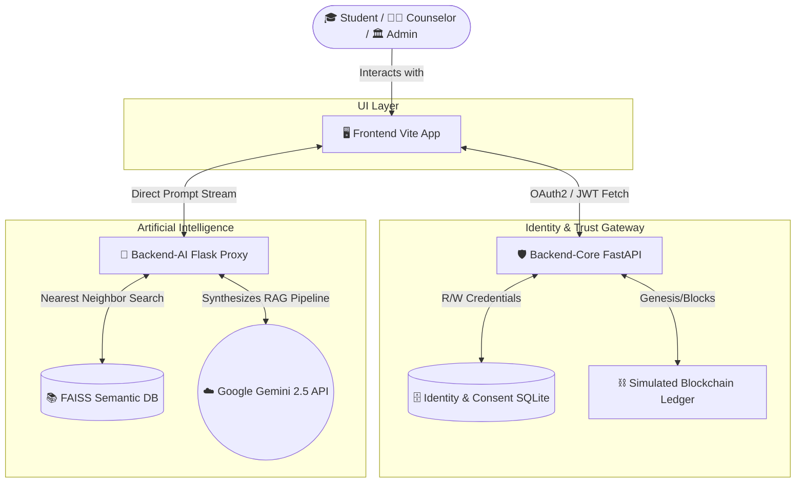
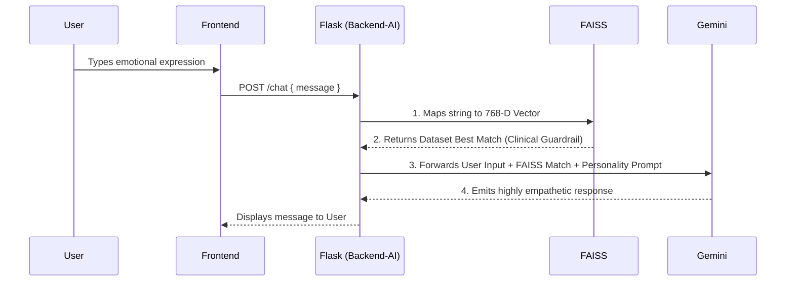

# 🌿 MoodFlow (formerly Healio)

> **AutoFlow AI & Cryptographic Privacy-First Mental Wellness Ecosystem**

MoodFlow is a next-generation mental health platform bridging the gap between clinical transparency and gentle, empathetic patient care. It functions as an intelligent journaling companion for students while provisioning highly secure, segmented operational dashboards for University Heads (Analytics) and Counselors (Interventions).

---

## 🏗️ System Architecture

Our platform utilizes a highly decoupled **three-tier microservice architecture** guaranteeing data isolation, specialized task delegation, and maximum security via blockchain-simulated Ledgers.



---

## ⚡ Application Workflow

The separation of the AI logic from the Identity Vault ensures no user credentials or explicit database mappings are sent directly to the LLM processor without explicit programmatic masking. 

### Core Chat & RAG Workflow (AutoFlow)


---

## 📂 Complete File Structure Explanation

```text
📦 MoodFlow (Root Workspace)
 ┣ 📂 frontend/              # The Interface Layer
 ┃ ┣ 📂 src/
 ┃ ┃ ┣ 📂 components/        
 ┃ ┃ ┃ ┣ 📂 common/          # Reusable Kawaii UI assets (Mochi, PetalSpirit)
 ┃ ┃ ┃ ┣ 📂 dashboard/       # The core application screens (MoodGraph, Trackers)
 ┃ ┃ ┃ ┗ 📂 games/           # CBT interactive applets (Breathing, Capsule)
 ┃ ┃ ┣ 📂 context/           # React Context (AuthContext) handling JWT rehydration
 ┃ ┃ ┣ 📂 pages/             # Specialized view layouts (Landing, Student, Admin, ProLogin)
 ┃ ┃ ┣ 📂 services/          # api.js acts as the universal fetch gateway across ports
 ┃ ┃ ┗ 📂 utils/             # Native JavaScript (e.g., generateWellnessReport for clinical PDFs)
 ┃ ┗ 📜 index.html           # Vite Entry Point
 ┃
 ┣ 📂 backend-core/          # The Identity & Trust Vault (Port 8000)
 ┃ ┣ 📂 app/         
 ┃ ┃ ┣ 📂 analytics/         # Data Aggregation routes securely feeding the University Admin
 ┃ ┃ ┣ 📂 auth/              # JWT issuance, Registration, and bcrypt payload processing
 ┃ ┃ ┣ 📂 blockchain/        # SHA-256 Immutable Ledger containing the genesis logic (`service.py`)
 ┃ ┃ ┣ 📂 consent/           # API hooks triggering blockchain actions (Grant/Revoke)
 ┃ ┃ ┣ 📂 counselor/         # Specialized API endpoints serving the Patient Roster UI
 ┃ ┃ ┣ 📂 mental_insights/   # SQLite interfaces ingesting user-mood data
 ┃ ┃ ┗ 📜 main.py            # The FastAPI engine mounting all `/api/v1/` routers
 ┃ ┗ 📜 moodflow_vault.db    # Relational Database mapping (Users, Consent, History)
 ┃
 ┣ 📂 backend-ai/            # The AutoFlow NLP Engine (Port 5000)
 ┃ ┣ 📂 app/                 
 ┃ ┃ ┣ 📜 chatbot_logic.py   # RAG pipeline routing text back & forth to Gemini/FAISS
 ┃ ┃ ┗ 📜 routes.py          # The Flask HTTP listener capturing Frontend string events
 ┃ ┣ 📂 model/               
 ┃ ┃ ┣ 📂 saved_models/      # Compiled `brain_index.faiss` vector database 
 ┃ ┃ ┣ 📜 preprocess.py      # Cleans the 422,000+ CSV dataset
 ┃ ┃ ┗ 📜 train_model.py     # Invokes `gemini-embedding-001` to compile the FAISS brain
 ┃ ┗ 📜 run.py               # Application Entry Point
 ┃
 ┗ 📂 voice-analysis/        # Voice/Tone recognition gateway (Ancillary FastAPI)
```

## 🚀 Environment Startup Guide

To launch the full micro-service cluster sequentially on a local machine:

1. **Start the Trust Vault (FastAPI Core):**
   ```bash
   cd backend-core
   source venv/bin/activate  # (venv\Scripts\activate on Windows)
   uvicorn app.main:app --reload --port 8000
   ```

2. **Start the AutoFlow Neural Engine (Flask NLP):**
   ```bash
   cd backend-ai
   source venv/bin/activate
   # Setup `.env` containing GEMINI_API_KEY
   python run.py 
   ```

3. **Launch the Interface (React):**
   ```bash
   cd frontend
   npm install
   npm run dev
   ```
